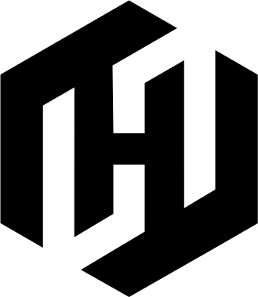
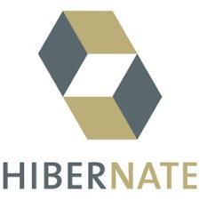
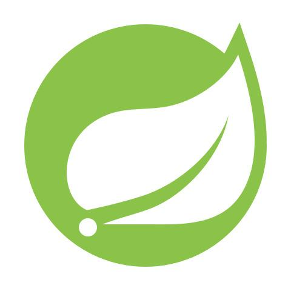
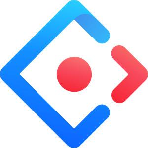
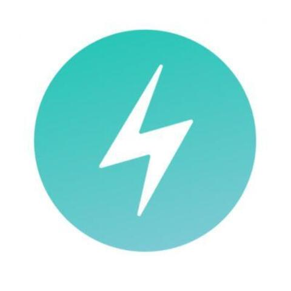
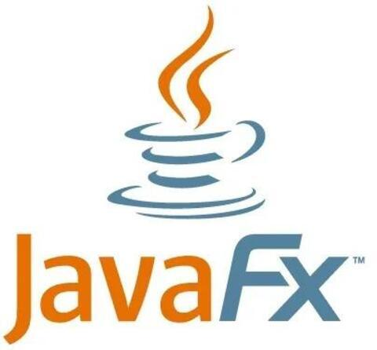
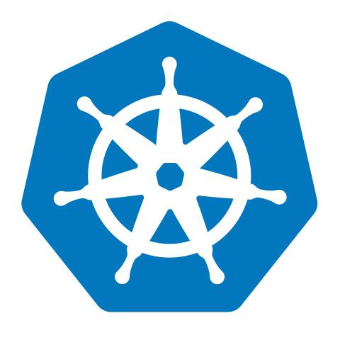

    <!-- <a href="https://www.linkedin.com/in/zeindevs/" title="LinkdeIn" target="_blank"> -->
    <!--    -->
    <!-- </a> -->
    <!-- <a href="https://x.com/zeindevs" title="Twitter" target="_blank"> -->
    <!--    -->
    <!-- </a> -->
    <!-- <a href="https://github.com/zeindevs" title="GitHub" target="_blank"> -->
    <!--    -->
    <!-- </a> -->
    <!-- <a href="https://youtube.com/zeindevs" title="YouTube" target="_blank"> -->
    <!--    -->
    <!-- </a> -->
    <!-- <a href="https://www.instagram.com/zeindevz/" title="Instagram" target="_blank"> -->
    <!--    -->
    <!-- </a> -->
    <!-- <a href="https://www.zeindevs.com/" title="Website" target="_blank"> -->
    <!--    -->
    <!-- </a> -->
    <!--  -->
    
        
    
    <!-- <a href="https://www.zeindevs.com/" title="Website" target="_blank"> -->
    <!--    -->
    <!-- </a> -->

<!--START_SECTION:waka-->
<!--END_SECTION:waka-->

#### Talking about Personal Stuffs

- 💻 I’m a Full-stack Developer;
- 🌱 I'm improving my skills in React and Golang;
- 💬 Ask me about anything, I am happy to help;
- 📫 How to reach me: [zeindevs@gmail.com](mailto:zeindevs@gmail.com);
- ⚽ My hobbies: Reading and Listening Music.

#### Languages and Tools

    
    <!--  -->
    <!--  -->
    
    <!--  -->
    <!--  -->
    <!--  -->
    <!--  -->
    
    <!--  -->
    <!--  -->
    
    <!-- <!--  -->
    
    
    
    <!--  -->
    <!--  -->

<!-- #### Main Project -->

<!-- - [2021-2025] [eyeosint](https://github.com/garudaproject/eyeosint) An OSINT (Open Source Intelligence) Platform for Information Gathering. -->
<!-- - [2021-2024] [watools](https://github.com/garudaproject/watools) Whatsapp Decryption and Database Viewer Support to .crypt12, .crypt14 and .crypt15. -->
<!-- - [2023-2024] [AIScaler](https://github.com/AIScaler/AIScaler) Free and Open Source AI Image Upscaler (Rewrite to C++). -->
<!-- - [2024] [Image Downloader Extensions](https://github.com/zeindevs/imagedl-extensions) Browser extension for downloading images and other useful features. -->
<!-- - [2024] [AnimAPI](https://github.com/zeindevs/animapi) NPM package that can be used to scraping data from anime websites. -->

<!-- **Side Project:** -->

<!-- - [2024] [Codeigniter CoCoSo](https://ci-cocoso.vercel.app) Simple Implementation CoCoSo Method in Codeigniter. -->
<!-- - [2024] [Laravel SAS-SV-KNN](https://github.com/zeindevs/laravel-sas-sv-knn) Simple Implementation SAS-SV with K-Nearest Neighbor Algorithm Method in Laravel. -->
<!-- - [2021] [OSINT Tools (UI Only)]() A profiling tool built using various sources of OSINT modules combined into a single tool. -->

<!-- **Utilities:** -->

<!-- - [2024] [urlclip](https://github.com/zeindevs/urlclip) Url reader from clipboard and save it like deamon. -->
<!-- - [2024] [golicense](https://github.com/zeindevs/golicense) License generator written in GO. -->
<!-- - [2024] [goignore](https://github.com/zeindevs/goignore) A gitignore generator with offline mode. -->
<!-- - [2024] [gowatch](https://github.com/zeindevs/gowatch) File watcher with custom command execution. -->

<!-- **UI Clone or Slicing (!!!Educational Purpose Only!!!):** -->

<!-- - [2024] [BWA UI Slicing](https://github.com/zeindevs/bwa-ui-slicing) UI slicing from the free resources of BWA. -->
<!-- - [2024] [DewaPOS UI](https://github.com/zeindevs/ui-dewapos) UI Template for Point of Sell Application. -->
<!-- - [2024] [DTFLab](https://astro-dtflab.netlify.app) (Company Profile) Astro -->
<!-- - [2024] [DigiPlay](https://uiclone-digiplay.netlify.app) (Game Store) HTML+CSS+Bootstrap -->
<!-- - [2024] [Otakudesu](https://uiclone-otakudesu.netlify.app/) React+Tailwindcss -->

#### Statistics

  
  

    
    
  

<!---
zeindevs/zeindevs is a ✨ special ✨ repository because its `README.md` (this file) appears on your GitHub profile.
You can click the Preview link to take a look at your changes.
--->

