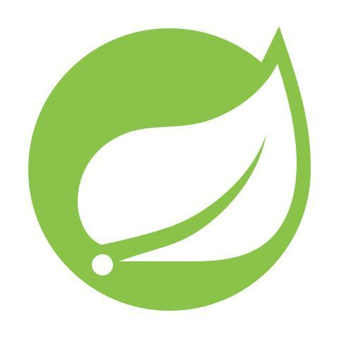
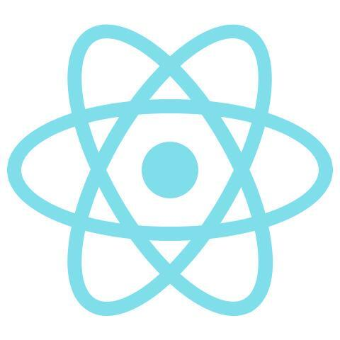

Hi, i'm [ZEN](https://www.zeindevs.com/), a Full-time freelancer with over two years of full-stack development experience. I am very hardworking and active, so I find it interesting to learn new technologies while spending more time and hone my professional skills.

**Talking about Personal Stuffs:**

- 💻 I’m a Full-stack Developer;
- 🌱 I'm improving my skills in React and Microservices;
- 💬 Ask me about anything, I am happy to help;
- 📫 How to reach me: [@zeindevs](https://www.linkedin.com/in/zeindevs/);
- ⚽ My hobbies: Reading, Watching Movies, Listening Music.

**Languages and Tools:**

  <a href="https://www.java.com/en/" title="Java" target="_blank">
    <code></code>
  </a>
  <a href="https://spring.io/" title="Spring" target="_blank">
    <code></code>
  </a>
  <a href="https://hibernate.org/" title="Hibernate" target="_blank">
    <code></code>
  </a>
   <a href="https://openjfx.io/" title="JavaFX" target="_blank">
    <code></code>
  </a>

  <a href="https://www.php.net/" title="PHP" target="_blank">
    <code></code>
  </a>
  <a href="https://laravel.com/" title="Laravel" target="_blank">
    <code></code>
  </a>
  <a href="https://nodejs.org/" title="Node.js" target="_blank">
    <code></code>
  </a>
   <a href="https://expressjs.com/" title="Express.js" target="_blank">
    <code></code>
  </a>

  <a href="https://www.python.org/" title="Python" target="_blank">
    <code></code>
  </a>
  <a href="https://fastapi.tiangolo.com/" title="FastAPI" target="_blank">
    <code></code>
  </a>
   <a href="https://www.qt.io/" title="Qt" target="_blank">
    <code></code>
  </a>

  <a href="https://www.postgresql.org/" title="Postgresql" target="_blank">
    <code></code>
  </a>
   <a href="https://www.mysql.com/" title="MySQL" target="_blank">
    <code></code>
  </a>
   <a href="https://www.mongodb.com/" title="MongoDB" target="_blank">
    <code></code>
  </a>

   <a href="https://www.javascript.com/" title="Javascript" target="_blank">
    <code></code>
  </a>
  <a href="https://www.typescriptlang.org/" title="Typescript" target="_blank">
    <code></code>
  </a>
  <a href="https://react.dev/" title="React" target="_blank">
    <code></code>
  </a>
  <a href="https://nextjs.org/" title="Next.js" target="_blank">
    <code></code>
  </a>
  <a href="https://astro.build/" title="Astroo.js" target="_blank">
    <code></code>
  </a>

   <a href="https://getbootstrap.com/" title="Bootstrap CSS" target="_blank">
    <code></code>
  </a>
  <a href="https://tailwindcss.com/" title="Tailwindcss" target="_blank">
    <code></code>
  </a>
   <a href="https://and.design/" title="Ant Design" target="_blank">
    <code></code>
  </a>

   <a href="https://reactnative.com/" title="React Native" target="_blank">
    <code></code>
  </a>
   <a href="https://www.flutter.dev/" title="Flutter" target="_blank">
    <code></code>
  </a>

  <a href="https://www.docker.com/" title="Docker" target="_blank">
    <code></code>
  </a>
  <a href="https://kubernetes.io/" title="Kubernetes" target="_blank">
    <code></code>
  </a>

**Statistics:**

  
📈 My GitHub Stats

   
  
  

<!---
zeindevs/zeindevs is a ✨ special ✨ repository because its `README.md` (this file) appears on your GitHub profile.
You can click the Preview link to take a look at your changes.
--->
