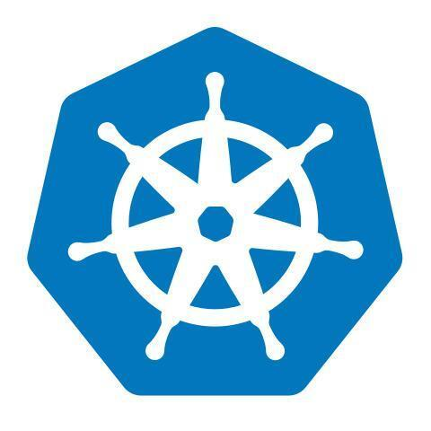

An Independent Full Stack Developer, with 3 years of experience. I create open source software for my own needs and ideas come up.

For work, please contact me via email [zeindevs@gmail.com](mailto:zeindevs@gmail.com).

<a href="https://www.linkedin.com/in/zeindevs/" title="LinkdeIn" target="_blank">
  
<!--    -->
</a>
<a href="https://x.com/zeindevs" title="Twitter" target="_blank">
  
<!--    -->
</a>
<!--  -->
<!--  -->
<a href="https://www.instagram.com/zeindevz/" title="Instagram" target="_blank">
  
<!--    -->
</a>
<!--  -->

<!--  -->

<!--  -->

**Talking about Personal Stuffs:**

- 💻 I’m a Full-stack Developer;
- 🌱 I'm improving my skills in React and Golang;
- 💬 Ask me about anything, I am happy to help;
- 📫 How to reach me: [@zeindevs](https://www.linkedin.com/in/zeindevs/);
- ⚽ My hobbies: Reading and Listening Music.

**Languages and Tools:**

  <!-- <a href="https://www.cprogramming.com/" title="C" target="_blank">
    <code></code>
  </a> -->
  
  
  
  
  
  
  
  
  <!-- <a href="https://hibernate.org/" title="Hibernate" target="_blank">
    <code></code>
  </a> -->
  
  
  
  <!-- <a href="https://spring.io/" title="Spring" target="_blank">
    <code></code>
  </a> -->
  
  
  
  
  
  
  
  
  <!--  -->
  <!--  -->
  
  <!--  -->
  
  <!-- <a href="https://openjfx.io/" title="JavaFX" target="_blank">
    <code></code>
  </a> -->
  
  
  
    
  
  
  
    
    
  
    
  <!-- <a href="https://kubernetes.io/" title="Kubernetes" target="_blank">
    <code></code>
  </a> -->

**Main Project:**

- [2024] [GOSINT]() OSINT Platform for Information Collection, Anonomously, Securely and Encrypted.
- [2024] [MAURIN]() All in One Digital Forensics and Intelligence Tool Kits.
- [2024] [WATools]() Whatsapp Decryption and Database Viewer Support to .crypt12, .crypt14 and .crypt15.
- [2023-2024] [AIScaler](https://github.com/AIScaler/AIScaler) Free and Open Source AI Image Upscaler (Rewrite to C++).
- [2024] [Image Downloader Extensions](https://github.com/zeindevs/imagedl-extensions) Browser extension for downloading images and other useful features.
<!-- - [2024] [AnimAPI](https://github.com/zeindevs/animapi) NPM package that can be used to scraping data from anime websites. -->

**Side Project:**

- [2024] [Codeigniter CoCoSo](https://ci-cocoso.vercel.app) Simple Implementation CoCoSo Method in Codeigniter.
- [2024] [Laravel SAS-SV-KNN](https://github.com/zeindevs/laravel-sas-sv-knn) Simple Implementation SAS-SV with K-Nearest Neighbor Algorithm Method in Laravel.
- [2021] [OSINT Tools (UI Only)]() A profiling tool built using various sources of OSINT modules combined into a single tool.

**Utilities:**

- [2024] [golicense](https://github.com/zeindevs/golicense) License generator written in GO.
- [2024] [goignore](https://github.com/zeindevs/goignore) A gitignore generator with offline mode.
- [2024] [gowatch](https://github.com/zeindevs/gowatch) File watcher with custom command execution.

**UI Clone or Slicing (!!!Educational Purpose Only!!!):**

- [2024] [BWA UI Slicing](https://github.com/zeindevs/bwa-ui-slicing) UI slicing from the free resources of BWA.
- [2024] [DewaPOS UI](https://github.com/zeindevs/ui-dewapos) UI Template for Point of Sell Application.
- [2024] [DTFLab](https://astro-dtflab.netlify.app) (Company Profile) Astro
- [2024] [DigiPlay](https://uiclone-digiplay.netlify.app) (Game Store) HTML+CSS+Bootstrap
<!-- - [2024] [Otakudesu](https://uiclone-otakudesu.netlify.app/) React+Tailwindcss -->

**Statistics:**

  
  

    
    
  

<!---
zeindevs/zeindevs is a ✨ special ✨ repository because its `README.md` (this file) appears on your GitHub profile.
You can click the Preview link to take a look at your changes.
--->
