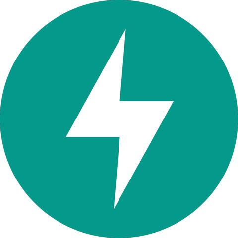
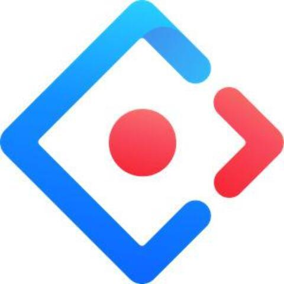

Hi, i'm [ZEN](https://www.zeindevs.com/), a Full-time freelancer with over two years of full-stack development experience. I am very hardworking and active, so I find it interesting to learn new technologies while spending more time and hone my professional skills.

<a href="https://www.linkedin.com/in/zeindevs/" title="LinkdeIn" target="_blank">
  
<!--    -->
</a>
<a href="https://twitter.com/zeindevs" title="Twitter" target="_blank">
  
<!--    -->
</a>
<!--  -->
<a href="https://youtube.com/zeindevs" title="YouTube" target="_blank">
  
<!--    -->
</a>
<a href="https://www.instagram.com/zeindevs/" title="Instagram" target="_blank">
  
<!--    -->
</a>
<!--  -->

<!--  -->

**Talking about Personal Stuffs:**

- 💻 I’m a Full-stack Developer;
- 🌱 I'm improving my skills in React and Microservices;
- 💬 Ask me about anything, I am happy to help;
- 📫 How to reach me: [@zeindevs](https://www.linkedin.com/in/zeindevs/);
- ⚽ My hobbies: Reading, Watching Movies, Listening Music.

**Languages and Tools:**

  <!-- <a href="https://www.cprogramming.com/" title="C" target="_blank">
    <code></code>
  </a> -->
  <a href="https://www.cprogramming.com/" title="C++" target="_blank">
    <code></code>
  </a>
  <a href="https://www.php.net/" title="PHP" target="_blank">
    <code></code>
  </a>
  <a href="https://nodejs.org/" title="Node.js" target="_blank">
    <code></code>
  </a>
  <a href="https://www.python.org/" title="Python" target="_blank">
    <code></code>
  </a>

  <a href="https://www.javascript.com/" title="Javascript" target="_blank">
    <code></code>
  </a>
  <a href="https://www.typescriptlang.org/" title="Typescript" target="_blank">
    <code></code>
  </a>
  <a href="https://go.dev/doc/articles/wiki/" title="Golang" target="_blank">
    <code></code>
  </a>
  <a href="https://www.java.com/en/" title="Java" target="_blank">
    <code></code>
  </a>
  <!-- <a href="https://hibernate.org/" title="Hibernate" target="_blank">
    <code></code>
  </a> -->

  <a href="https://laravel.com/" title="Laravel" target="_blank">
    <code></code>
  </a>
  <a href="https://expressjs.com/" title="Express.js" target="_blank">
    <code></code>
  </a>
  <a href="https://fastapi.tiangolo.com/" title="FastAPI" target="_blank">
    <code></code>
  </a>
  <a href="https://spring.io/" title="Spring" target="_blank">
    <code></code>
  </a>

  <a href="https://react.dev/" title="React" target="_blank">
    <code></code>
  </a>
  <a href="https://nextjs.org/" title="Next.js" target="_blank">
    <code></code>
  </a>
  <a href="https://vuejs.org/" title="Vue" target="_blank">
    <code></code>
  </a>
  <a href="https://astro.build/" title="Astroo.js" target="_blank">
    <code></code>
  </a>

  <a href="https://getbootstrap.com/" title="Bootstrap CSS" target="_blank">
    <code></code>
  </a>
  <a href="https://tailwindcss.com/" title="Tailwindcss" target="_blank">
    <code></code>
  </a>
  <a href="https://ant.design/" title="Ant Design" target="_blank">
    <code></code>
  </a>
  <!-- <a href="https://chakra-ui.com/" title="Chakra UI" target="_blank">
    <code></code>
  </a> -->

  <a href="https://reactnative.com/" title="React Native" target="_blank">
    <code></code>
  </a>
  <a href="https://www.flutter.dev/" title="Flutter" target="_blank">
    <code></code>
  </a>
  <a href="https://www.qt.io/" title="Qt" target="_blank">
    <code></code>
  </a>
  <!-- <a href="https://openjfx.io/" title="JavaFX" target="_blank">
    <code></code>
  </a> -->

  <a href="https://www.postgresql.org/" title="Postgresql" target="_blank">
    <code></code>
  </a>
  <a href="https://www.mysql.com/" title="MySQL" target="_blank">
    <code></code>
  </a>
  <a href="https://www.mongodb.com/" title="MongoDB" target="_blank">
    <code></code>
  </a>

  <a href="https://www.docker.com/" title="Docker" target="_blank">
    <code></code>
  </a>
  <a href="https://www.linux.org/" title="Linux" target="_blank">
    <code></code>
  </a>
  <!-- <a href="https://kubernetes.io/" title="Kubernetes" target="_blank">
    <code></code>
  </a> -->

**Projects:**

- [2024] [Laravel SAS-SV-KNN](https://github.com/zeindevs/laravel-sas-sv-knn) Simple Implementation SAS-SV with K-Nearest Neighbor Algorithm Method in Laravel.
- [2024] [DewaPOS UI](https://github.com/zeindevs/ui-dewapos) UI Template for Point of Sell Application.
- [2024] [Image Downloader Extensions](https://github.com/zeindevs/imagedl-extensions) Browser extension for downloading images and other useful features.
- [2023] [AIScaler](https://github.com/AIScaler/AIScaler) Free and Open Source AI Image Upscaler.
- [2021] [OSINT Tools (UI Only)](https://github.com/zeindevs/ui-osint-tools) A profiling tool built using various sources of OSINT modules combined into a single tool.

**UI Clone (!!!Educational Purpose Only!!!)**

- [2024] [DigiPlay](https://uiclone-digiplay.netlify.app/) HTML+CSS+Bootstrap
- [2024] [Otakudesu](https://uiclone-otakudesu.netlify.app/) React+Tailwindcss

**Statistics:**

  
📈 My GitHub Stats

   
  
  

<!---
zeindevs/zeindevs is a ✨ special ✨ repository because its `README.md` (this file) appears on your GitHub profile.
You can click the Preview link to take a look at your changes.
--->
